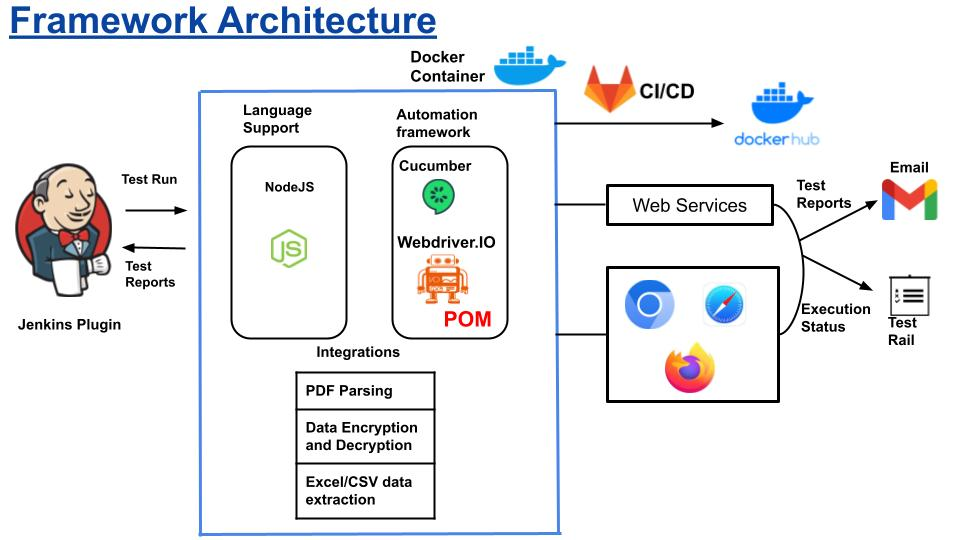
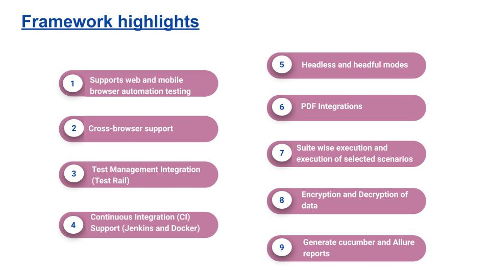

# JS_WDIO_framework

## Getting started

WDIO Cucumber framework




This project is currently based on

 - WDIO
 - Cucumber
 
## Project Structure
- allure-config
Configuration file for allure reporter
- config
Contains API endpoints and configuration files for tst, stg and prd environment. Update app url and user credentials here
- datainput
Place your input excel files here
- features
Write your Cucumber feature files here
- helper
Helper files required for supporting data input
- page-objects
Write your page elements and supporting business functions here
- reports
Contains the report after execution
- setup
Contains the test setup and intialization files
- step-definitions
Write your Cucumber Step definitions here
- testData
Place your api input data json here
- utils
Write your business utility functions here
- cucumber.js
Add your Cucumber profiles in this file which can then be used in package.json scripts
- execute.sh
This file can be used for command line and CICD execution of tests

## Pre-requisites
```
Node : v18.16.0 (recommended)
npm : 9.6.7 (recommended)
```

## Run Tests
- Clone repo https://code.qburst.com/adarshvijayan/wdio_cucumber_framework.git
- Install the project using `npm install` command
- Update the /setup/configData.js with values for the below variables

```
parallel: 1
headlessMode: false
device: devices['Nexus 10']
default_timeout: 30,
```

Note: 
- browserName takes below 3 values which can passed as cmd arguments
```
chromium (default - if no browser is passed)
firefox
webkit
```
- parallel takes any numeric value greater than `0`
```
0 - Execute tests in Parallel mode
1 - Execute tests in Sequential mode
```
- default_timeout takes any numeric value greater than `0`
```
Here the browser times out after the specified time, the value passed should be in seconds.
Default value is set to 30 seconds.
```
- headlessMode : `true` or `false` (Default `False` if no value is provided)
- device takes predefined device names supported by WDIO. Some of them are
`Galaxy S9+`, `Galaxy Tab S4`, `iPad Mini`, `iPhone 11`, `iPhone 12`, `iPhone X`.

If you want to run in browser resolution, keep the value empty, for eg: devices['']
Always use webkit for iOS mobile viewports and chrome for Android mobile viewports
- Update the username and password in base64 encrypted format in respective environment files in config/<>.json
```
"username": "",
"password": """
```
- Use this command to run the test in required environments with default values : tst, stg, prd
Following commands will execute on Chromium browser with Cucumber report by default
```
npm run tst
```
```
npm run stg
```
```
npm run prd
```

To run regression in tst environment: 
Note :- This framework picks Scenarios with tag @Regression as regression test cases
```
npm run regression
```

- To run tests with various parameters
```
browser=firefox test_env=tst reporter=cucumber npm run testing
```
```
browser=firefox test_env=tst npm run tst
```

- To run different suites using execute.sh
```
./execute.sh tst firefox allure
```
Note: Change the environment, browser or reporter values in above commandas per need. Please make sure to run the command in argument order same as above.

To use allure reporting use the allure profile in scripts for the required environment within package.json file as:
```
"test": "rm -rf reports && chmod +rwx execute.sh && ./execute.sh && npx cucumber-js -p allure"

```
Note:
- You can make any number of profiles with a particular tag in the cucumber.js file 
- We have used the cucumber reporting by default.
- Use allure reporting with the allure profile as '-p allure' within the scripts.
- While allure reporting dot report wont be generated.
- Adjust the package.json script and cucumber.js to run the required scenarios in a particular environment. Refer [here](https://github.com/cucumber/cucumber-js/blob/main/docs/profiles.md#using-profiles-for-arguments) on how to run multiple profiles

## To run multiple scenarios:
- Update the scenario names in suites/default-scenarios.csv in the format "``scenario:`` exact_scenario_name"
- You can also create new csv files inside the suites folder with scenarios listed in the format "``scenario:`` exact_scenario_name"
- You can execute the scenarios using the shell script:

```
chmod +x multiple.sh
./multiple.sh scenarios.csv
```
- Here you should replace ``scenarios.csv`` to the csv file you want to use and it should be located in the ./suites folder.
- All the scenarios listed within the ``scenarios.csv`` will be executed
- You can also specify the test environment, browser, and report to be used as follows:

```
./multiple.sh scenarios.csv tst chrome cucumber
```
- By default we will be running all the scenarios listed within suites/default-scenarios.csv file in the ``tst`` environment on the ``chrome`` browser and we use ``cucumber`` reporting.

## To update the test status for the particular test case in test rail
- You can use the command:

```
npm run run-in-testrail
```
Note: the `runname` value can be based on your run in `Test Runs & Results` in `Test Rail`


## Run Lint for static code analysis
   ```
   Tool Used : eslint
   Command : npm run lint
   
   ```

## Generate Cucumber report
After executing the tests, corresponding cucumber-report.json file will be generated in reports/json
Run the following command to genereat html version of cucumber report
   ```
   Command : npm run cucumber-report
   ```

## Generate allure report
After executing the tests, corresponding allure result xmls will be generated in reports/json/allure-results
Run the following command to generate html version of allure report
   ```
      Command : npm run generate-allure
      Command : npm run allure-report

   ```

## Open-Trace
   ```
   Command : npm run open-trace
   Note: By default trace is generated for each feature and can be viewed in a single trace view

   ``` 
## Email the report
   - You should first configure your username and app password within setup/configData.js.
   - Recipient list should be updated in the `send-report` script in `package.json`.
   - Comma-separated recipient list can be added.
   ```
   Command : npm run send-report
   Note: By default the system emails a basic email test report.
   
   ```
   `Email with Allure-report`
   ```
   command: npm run send-report allure
   Note: This sends the basic test email along with allure-report.html and allure.pdf
   ```
   `Email with Cucumber-report`
   ```
   command: npm run send-report cucumber
   Note: This sends the basic test email along with cucumber-report.html
   ```
## Read Data from excel sheet


    Note:
    -User should add excel sheet in "datainput" folder as xlsx file
    -User can read data from the xlsx file by using file path and sheet name
    -The sheet name should match with sheet name in excel sheet for reading excel sheet
    -User can read data under a particular header by passing the header name
    -User can also get values as dictionary by using "getAsdict" method
    
## Using docker

  `Pre-requisite`
  ```
  Should have docker installed
  Should be logged into the docker-hub account to publish latest docker images
  ```
  `Use the following command to build a docker image`
  ```
  docker build --build-arg SECRET_KEY=$SECRET_KEY -t docker-hub-username/image-name .   
  ```
  `Command for tagging a docker image`
  ```
  docker tag docker-hub-username/image-name docker-hub-username/image-name:tag_name
  ```
  `Command for running the docker image`
  ```
  docker run docker-hub-username/image-name:tag_name
  ```
  `You can also specify the environment variables while running` 
  ```
  docker run -e ENV=tst -e BROWSER=firefox -e REPORT=cucumber docker-hub-username/image-name:tag_name
  ```

## CICD Integration with Jenkins

  `Pre-requisite`
  ```
  xvfb plugin should be installed
  After installation configure the plugin in Global Tool Configuration
    Name : "default Xvfb"
    Directory in which to find Xvfb executable : "/usr/bin/X11"
    
    Enable "Start Xvfb before the build, and shut it down after." option in Jenkins job configuration "Build Environment" section
  ```
  `Use the following command in Jenkins script execution window for running the tests`
  ```
npm install
chmod +x execute.sh
./execute.sh ${env} ${browser} ${reporter}
  ```